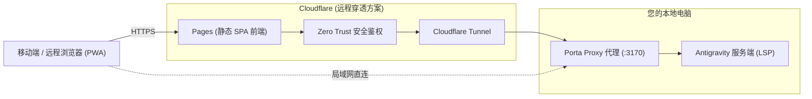

# Porta 移动端 & 远程 Web 客户端

[](LICENSE)


**Porta** 是专为 [Google Antigravity](https://antigravity.google/) AI 智能体管理器打造的轻量级远程 Web / PWA 客户端。通过高精度的 LSP（语言服务协议）轻量级代理桥接，您可以在手机、平板电脑或任何远程设备的浏览器中，无缝操控和实时协同本地运行的 Antigravity AI 开发会话。

Porta 由两个核心部分组成：
1. **Proxy 代理服务**：网络与本地 Antigravity Language Server 之间的通信桥梁。
2. **Web 前端 (可安装 PWA)**：适配移动触控与现代 UI 设计的高颜值响应式交互界面。

<p align="center">
  
</p>

<p align="center">
  
</p>

---

## 🌟 核心特性与优势

- 📱 **极致移动端体验**：深度适配手机与平板操作，内置智能手势交互（滑动切屏/返回）、触觉反馈 (Haptics)、架构图弹窗预览、语音输入与沉浸式沉浸布局。
- ⚡ **超低带宽 & 毫秒级响应**：仅传输结构化的 JSON 数据与增量文本流，非像素投屏或重度图像传输，轻松满足移动网络下的低延迟流畅交互。
- 🌏 **全面中文与本地化支持**：内置完整的中文化界面、状态提示与交互卡片，彻底消除语言 barrier。
- 🔒 **隐私安全保障**：所有代码上下文和对话历史完全停留在您自己的本地设备上，无需经过第三方中转服务器。
- 🌐 **无缝远程接入**：支持局域网 (LAN) 内网络直连，或通过 Cloudflare Tunnel / Zero Trust 搭建高安全级的免费远程访问隧道。

---

## 🚀 快速开始

### 依赖环境
- **Node.js** $\ge 22$
- **pnpm** $\ge 10$
- 本地正在运行的 **[Antigravity](https://antigravity.google/)** 实例。

> ⚠️ **注意**：Porta 是连接本地 Antigravity 服务的桥梁。启动 Porta 前请确保本地 Antigravity 已正常运行。

### 本地安装与启动

```bash
# 1. 克隆项目仓库
git clone https://github.com/maobukeai/porta.git
cd porta

# 2. 安装项目依赖
pnpm install

# 3. 配置环境变量（根据需要复制修改）
cp .env.example .env

# 4. 启动开发模式（同时启动 Proxy 代理:3170 与 Web 前端:3070）
pnpm dev
```

启动完成后，在浏览器访问 `http://localhost:3070` 即可使用。

### 🏠 局域网 (LAN) 移动设备访问

如需在同一个 Wi-Fi 或局域网下的手机/平板中访问：

1. 在 `.env` 文件中配置宿主机的局域网 IP：
   ```env
   PORTA_HOST=192.168.1.X
   ```
2. 启动 Vite 开发服务器并开启 `--host` 绑定：
   ```bash
   pnpm --filter @porta/web dev -- --host
   ```
3. 手机浏览器访问 `http://192.168.1.X:3070` 即可，可直接添加至手机桌面作为 PWA 应用使用。

---

## 📊 为什么选择 Porta？与其他远程方案对比

| 接入方案 | 传输数据格式 | 网络带宽消耗 | 交互延迟 | 移动端 UX 适配 | 私有化部署 |
| :--- | :--- | :--- | :--- | :--- | :--- |
| **远程桌面** (VNC / RDP / Parsec) | 视频 / 像素流 | 高 ($\ge 10\text{Mbps}$) | 明显延迟 | 较差（文字极小、无手势触控） | ✅ |
| **SSH / 端口转发** | 原始 TCP | 低 | 低 | 纯终端无图形化 UI | ✅ |
| **云端 IDE** (Codespaces / Gitpod) | 完整工作区环境 | 不适用（云端计算） | 波动较大 | 重度、触控体验一般 | ❌ |
| **Porta** | **结构化 LSP 数据** | **极低 (KB级)** | **实时 WebSocket** | **原生 PWA / 专属移动端 UX** | ✅ |

---

## 🛠️ 系统架构与远程访问模式



### 两种访问模式：

1. **局域网直连模式**（推荐在家庭 / 办公室 Wi-Fi 下使用）：
   手机浏览器直接通信至局域网内部的 Porta Proxy，简单快捷。
2. **Cloudflare Tunnel 远程访问**（推荐外出时使用）：
   配合 Cloudflare Pages + Named Tunnel + Zero Trust，在不暴露公网 IP 的前提下实现安全的随时随地远程控制。具体配置请参考 `.env.example` 中的指示说明。

---

## 💻 平台支持

| 级别 | 操作系统 | 支持状态 |
| :--- | :--- | :--- |
| **Tier 1** | Linux (x64) | 官方主要开发与测试平台 |
| **Tier 2** | Windows (x64) | 真实硬件充分测试，全面支持 PowerShell / Cmd |
| **Tier 3** | macOS | CI 自动集成校验通过 |

> 📌 **跨环境运行提示**：Porta 代理必须与 Antigravity 运行在同一环境侧。若 Antigravity 运行在 Windows 本地，请在 Windows 命令行中启动 Porta；若运行在 WSL2 内部，请在 WSL2 内部启动 Porta。

---

## 🤝 贡献与反馈

欢迎提 Issue 或 PR 来共同改进 Porta 的体验！
* 查看 [CONTRIBUTING.md](CONTRIBUTING.md) 了解详细的开发流程与代码规范。
* 安全漏洞汇报请参考 [SECURITY.md](SECURITY.md)。

---

## 📄 开源协议

本项目基于 [MIT 协议](LICENSE) 开源。
